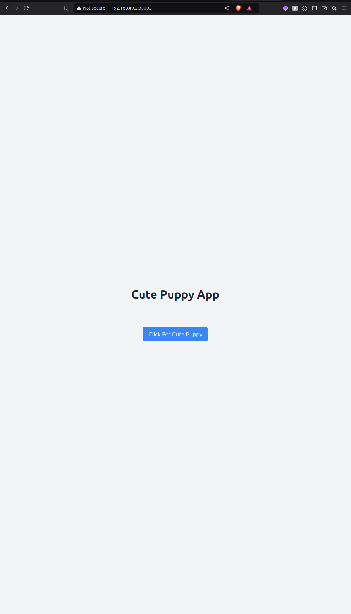
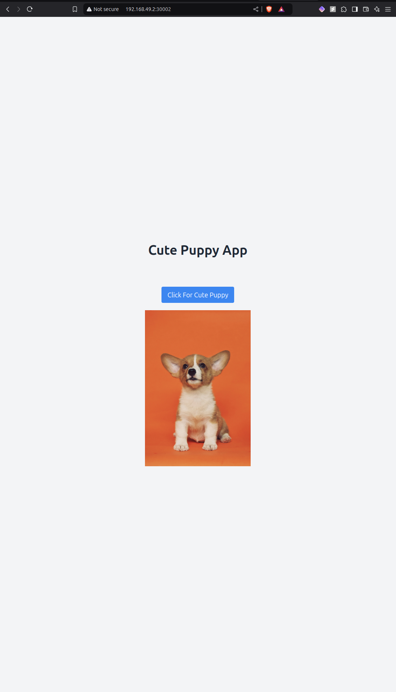

Showcase Devops principles. Developed a Client-Server application with CI/CD automation, using Jenkins to integrate a webhook-triggered pipeline that automatically tests, builds, and containerizes React and Express.js services. Successful builds and tests will be pushed to a private Docker Hub registry. Used Kubernetes for container orchestration, implementing a Horizontal Pod Autoscaler (HPA) to dynamically manage workloads and ensure scalability. 

# Puppy-Generator
Showcase Devops principles.

